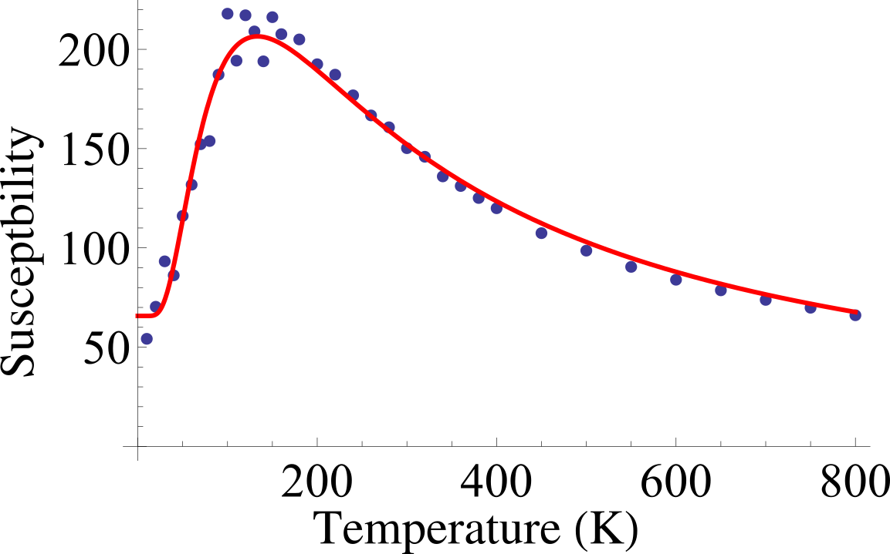

  

      <ul class="nav">
          <li><a href="https://dwang5.github.io">github</a></li>
      </ul>
  

<table class="wide">
<tr>
  <td class="left">
    <a href="pages/publpics/fittings.html">
    Phys. Rev. B **96**, 054115 
        
    </a>
  </td>
  <!-- <td class="right"> -->
    <!-- <a href="pages/publpics/rqtlexper_fig2.html"> -->
        <!--  -->
    <!-- </a> -->
  <!-- </td> -->
</tr>
