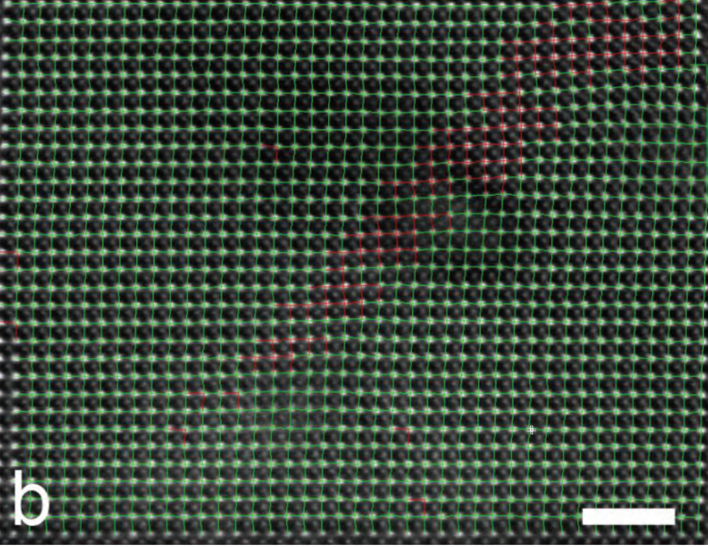

  

      <ul class="nav">
          <li><a href="https://dwang5.github.io">github</a></li>
      </ul>
  

<table class="wide">
<tr>
  <td class="left">
    
  </td>

  <td class="right">
  
  </td>
</tr>
