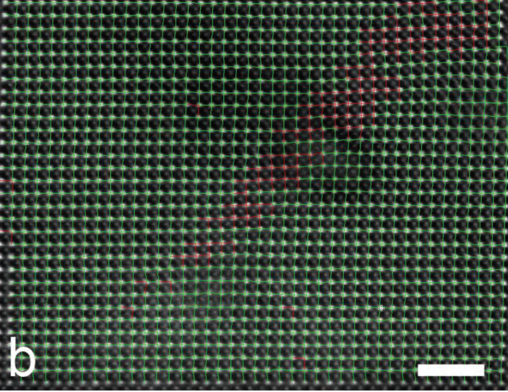

  

      <ul class="nav">
          <li><a href="fittings.html">prev</a></li>
          <li><a href="fittings.html">next</a></li>
      </ul>
  

*Automatic and accurate determination of atom peak location in
high-resolution electro microscopy image and fast visualization of
polarization domains*,
H. Nan, J. Lu, M. Liu, H. Jing, S. Tang, D. Wang, C. Jia
J. Chin. Electr. Microsc. Soc. **35**, 191 (2016).

**Figure 1**. &mdash; The analysis of an image of PTO using the axial
ration *c/a* values, which shows the deformation of each unit cell.
Choosing proper *c/a* threshold accurately distinguish the two types of
unit cells.

**This work is done using our home-grown software "Gloabl Atom
Positioning System (GAPS)"** [GAPS](./gaps.html)
