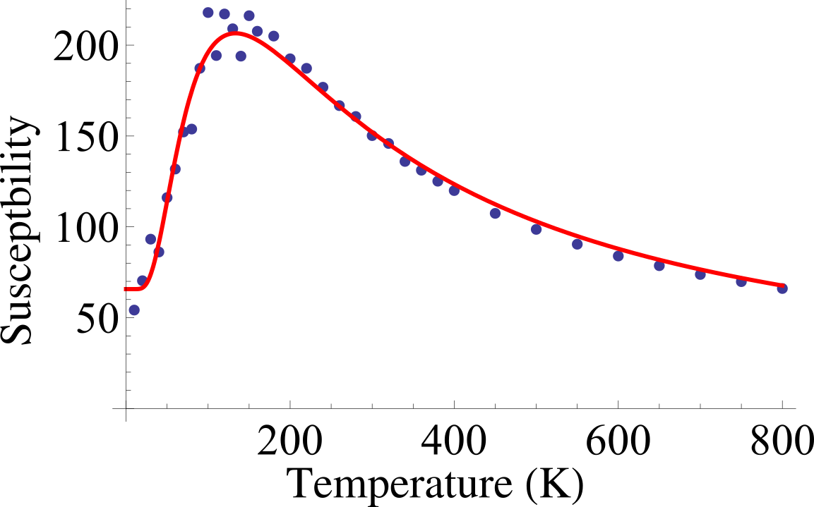

  

      <ul class="nav">
          <li><a href="fittings.html">prev</a></li>
          <li><a href="fittings.html">next</a></li>
      </ul>
  

*Insights into the dielectric response of ferroelectric relaxors from statistical modeling*,
J. Liu, F. Li, Y. Zeng, Z. Jiang, L. Liu, D. Wang, Z.-G. Ye, and C.-L. Jia
Phys. Rev. B **96**, 054115 

**Figure 1**. &mdash; Relaxors are interesting ferroelectric materials.
To understand how they evolve with temperature, we propose special
equations to fitted the "dielectric constant vs temperature" data, which
turns out to be quite successful. 

If you are interested, here we also provide the data and the
*Matheamtiac* program so that you can try it for yourself -- just put
the two files in the same directory, then start the Mathematica program.

<<<<<<< HEAD

=======

>>>>>>> e86e429bfe73b37e362c6e2b5a26bbc841686d92
